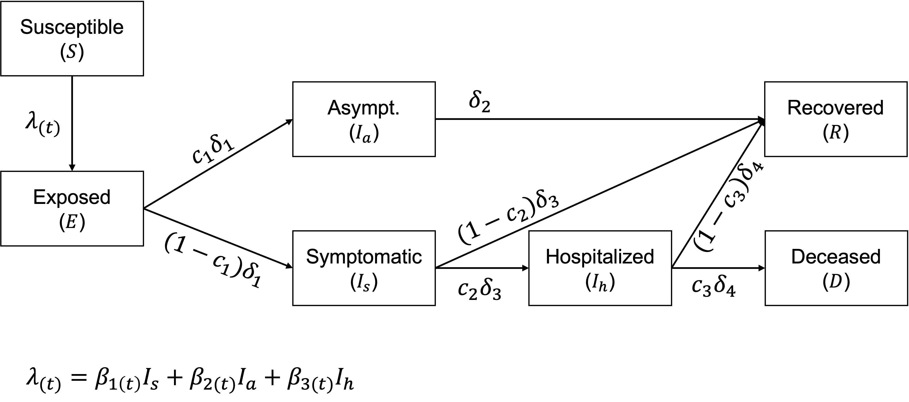

```{r setup, include=FALSE}
knitr::opts_chunk$set(echo = TRUE, fig.pos = 'h')
```

## Stochastic model of SARS-CoV-2 transmission and COVID-19 progression

Let us consider the following mathematical model of SARS-CoV-2:
$$\begin{aligned}
\frac{dS}{dt} &=   - S (\beta_{1(t)} I_s + \beta_{2(t)} I_a + \beta_{3(t)} I_h) \\
\frac{dE}{dt} &=  S (\beta_{1(t)} I_s + \beta_{2(t)} I_a + \beta_{3(t)} I_h) - \delta_1 E \\
\frac{dI_a}{dt} &=   c_1 \delta_1 E - \delta_2 I_a \\
\frac{dI_s}{dt} &=   (1 - c_1) \delta_1 E - \delta_3 I_s \\
\frac{dI_h}{dt} &=   c_2 \delta_3 I_s - \delta_4 I_h \\
\frac{dD}{dt} &=   c_3 \delta_4 I_h \\
\frac{dR}{dt} &=   \delta_2 I_a + (1 - c_2) \delta_3 I_s + (1 - c_3) \delta_4 I_h
\end{aligned}$$

```{r, out.width = "3.5in", echo=FALSE, fig.align='center'}

```

Following the lecture material, the model describes the transmission of the SARS-CoV-2 virus and the progression of COVID-19. Susceptible hosts ($S$) can become exposed ($E$) by contracting the virus from symptomatic individuals ($I_s$), asymptomatic individuals ($I_a$), or hospitalized individuals ($I_h$) at three different rates ($\beta_{1(t)}$, $\beta_{2(t)}$, or $\beta_{3(t)}$, respectively). We assume that $\beta_{1(t)} > \beta_{2(t)} > \beta_{3(t)}$. Notice that these rates can change through time, for instance, due to public health interventions. Exposed individuals then either become asymptomatically or symptomatically infectious after an average of $1/\delta_1$ days of viral incubation. $c_1$ represents the *proportion* of exposed individuals that become asymptomatically infectious, while all other individuals ($1-c_1$) become symptomatically infectious. Asymptomatic individuals become immune (recovered, $R$) after an average of $1/\delta_2$ days. After an average of $1/\delta_3$ days, a proportion ($c_2$) of symptomatic individuals will be hospitalized ($I_h$), while the rest ($1-c_2$) will recover and become immune ($R$). Similarly, after an average of $1/\delta_4$ days, a proportion ($c_3$) of hospitalized individuals will die of COVID-19 ($D$), while the rest ($1-c_3$) will recover and become immune ($R$). The model assumes that demography is not relevant at the time-scale of interest (e.g., a one-year outbreak of SARS-CoV-2), and that recovered individuals are immune for at least the time-scale of interest. 


\newpage
# Task 1 (0 points)

Below I have developed a tau-leaping algorithm to simulate the model with demographic stochasticity. Study the code and make sure you understand what is going on. 

First, we set up a function to advance the system one tau leap:
```{r tau-leap-func}

####################################################
# FUNCTION #
####################################################

tau_leap_1step = function(t, tau, 
                          s_vec, e_vec, ia_vec, is_vec, ih_vec, 
                          params){
  # Lots of events this time...
  n_events = 7
  
  # Event probabilities:
  event_prob = vector(mode = "numeric", length = n_events)
  
  ## Transmission from asymptomatic
  event_prob[1] = s_vec[t] * params$beta_1[t] / params$n_pop * is_vec[t]
  ## Transmission from symptomatic
  event_prob[2] = s_vec[t] * params$beta_2[t] / params$n_pop * ia_vec[t]
  ## Transmission from hospitalized
  event_prob[3] = s_vec[t] * params$beta_3[t] / params$n_pop * ih_vec[t]
  
  ## Leave E class
  event_prob[4] = e_vec[t] * params$delta_1
  ## Leave I_a class
  event_prob[5] = ia_vec[t] * params$delta_2
  ## Leave I_s class
  event_prob[6] = is_vec[t] * params$delta_3
  ## Leave I_h class
  event_prob[7] = ih_vec[t] * params$delta_4
    
  # How many events of each type will occur over time period tau
  n_occur = vector(mode = "numeric", length = n_events)
  
  for(i in 1:n_events){
    # Poisson random variate
    n_occur[i] = rpois(1, event_prob[i] * tau)
  }
  return(n_occur)
  
}


```

\newpage

Now, we can run a single realization of the stochastic COVID-19 model:
```{r one-realization, fig.height=4.5, fig.width=7, fig.align='center'}

####################################################
# SET-UP #
####################################################

# Time
tau = 1 # leap size (in days)
t_max = 365 # (in days)
n_times = floor(t_max / tau)
t_vec = seq(1, t_max, length.out = n_times)

# Keep track of pop sizes in each class
s_vec = vector(mode = "numeric", length = n_times)
e_vec = vector(mode = "numeric", length = n_times)
ia_vec = vector(mode = "numeric", length = n_times)
is_vec = vector(mode = "numeric", length = n_times)
ih_vec = vector(mode = "numeric", length = n_times)
d_vec = vector(mode = "numeric", length = n_times)
r_vec = vector(mode = "numeric", length = n_times)

# INITIAL CONDITIONS
n_pop = 3000
## We'll start with a symptomatically infectious individual:
is_vec[1] = 1
s_vec[1] = n_pop - is_vec[1]

# Parameters:

delta_1 = 1/5
delta_2 = 1/7
delta_3 = 1/10
delta_4 = 1/20
c1 = 0.4
c2 = 0.19
c3 = 0.1

# BETAS
beta_fill = c(
  rep(0.7, times=15),
  rep(0.2, times=15),
  rep(0.4, times=25),
  rep(0.1, times=20), 
  rep(0.15, times=50), 
  rep(1.2, times=10), 
  rep(0.1, times=90)
)
beta_1 = c(
  beta_fill, 
  rep(1.5, times=365-length(beta_fill))
)
beta_2 = 0.25*beta_1
beta_3 = 0.05*beta_1
  
params = list(
  beta_1 = beta_1,
  beta_2 = beta_2,
  beta_3 = beta_3,
  delta_1 = delta_1,
  delta_2 = delta_2,
  delta_3 = delta_3,
  delta_4 = delta_4,
  c1 = c1,
  c2 = c2,
  c3 = c3,
  n_pop = n_pop
)

####################################################
# Run one realization of the system
####################################################

# Start the clock:
t = 1

while(t <= (n_times-1)){
  
  # Move forward one time:
  n_occur = tau_leap_1step(t, tau, s_vec, e_vec, ia_vec, 
                           is_vec, ih_vec, params)
  
  #------------------------------------------------------
  #------------------------------------------------------
  # Update state variables

  ## First figure out which hosts go to which classes
  n_e_to_asym = rbinom(1, size = n_occur[4], prob = params$c1)
  n_e_to_sym = n_occur[4] - n_e_to_asym
  
  n_sym_to_hosp = rbinom(1, size = n_occur[6], prob = params$c2)
  n_sym_to_recov = n_occur[6] - n_sym_to_hosp
  
  n_hosp_to_dead = rbinom(1, size = n_occur[7], prob = params$c3)
  n_hosp_to_recov = n_occur[7] - n_hosp_to_dead
  
  # Now update the state variables
  s_vec[(t+1)] = s_vec[t] - sum(n_occur[1:3])
  e_vec[(t+1)] = e_vec[t] + sum(n_occur[1:3]) - n_occur[4]
  ia_vec[(t+1)] = ia_vec[t] + n_e_to_asym - n_occur[5]
  is_vec[(t+1)] = is_vec[t] + n_e_to_sym - n_occur[6]
  ih_vec[(t+1)] = ih_vec[t] + n_sym_to_hosp - n_occur[7]
  d_vec[(t+1)] = d_vec[t] + n_hosp_to_dead
  r_vec[(t+1)] = r_vec[t] + n_occur[5] + n_sym_to_recov + n_hosp_to_recov
  
  #------------------------------------------------------
  #------------------------------------------------------
  
  # Correct if any < 0
  if(s_vec[(t+1)] < 0) s_vec[(t+1)] = 0
  if(e_vec[(t+1)] < 0) e_vec[(t+1)] = 0
  if(ia_vec[(t+1)] < 0) ia_vec[(t+1)] = 0
  if(is_vec[(t+1)] < 0) is_vec[(t+1)] = 0
  if(ih_vec[(t+1)] < 0) ih_vec[(t+1)] = 0
  if(d_vec[(t+1)] < 0) d_vec[(t+1)] = 0
  if(r_vec[(t+1)] < 0) r_vec[(t+1)] = 0
  
  
  # Advance the time:
  t = t + 1

}


# Plot the dynamics of the virus for one realization:
plot(NA,NA,
     xlim = c(1, n_times),
     ylim = c(0, 500),
     xlab = "Time (days)",
     ylab = "Number Symptomatic")
lines(is_vec ~ t_vec, col="black")
```

\newpage

# Task 2 (5 points)

Plot the value of $\beta_1$ over time.

```{r}
plot(NA,NA,
     xlim = c(min(t_vec), max(t_vec)),
     ylim = c(min(beta_1), max(beta_1)),
     xlab = "Time (days)",
     ylab = "Beta 1 Value")

lines(beta_1 ~ t_vec, col="black")
```


# Task 3 (15 points)

Create a figure that shows 50 realizations of the number of **new hospitalizations per day**. *Hint*: The first step is figuring out the object in which this value is stored.

```{r}
plot(NA,NA,
     xlim = c(min(t_vec), max(t_vec)),
     ylim = c(0, 20),
     xlab = "Time (days)",
     ylab = "New Hospitalizations per Day")

c1 = 0.4
c2=0.19

  params = list(
    beta_1 = beta_1,
    beta_2 = beta_2,
    beta_3 = beta_3,
    delta_1 = delta_1,
    delta_2 = delta_2,
    delta_3 = delta_3,
    delta_4 = delta_4,
    c1 = c1,
    c2 = c2,
    c3 = c3,
    n_pop = n_pop
  )

for (i in 1:50){
  new_hospitalizations_vector = vector(mode="numeric")
  new_hospitalizations_vector <- append(new_hospitalizations_vector, 0)
  t=1
  while(t <= (n_times-1)){
    # Move forward one time:
    n_occur = tau_leap_1step(t, tau, s_vec, e_vec, ia_vec, 
                             is_vec, ih_vec, params)
    
    #------------------------------------------------------
    #------------------------------------------------------
    # Update state variables
  
    ## First figure out which hosts go to which classes
    n_e_to_asym = rbinom(1, size = n_occur[4], prob = params$c1)
    n_e_to_sym = n_occur[4] - n_e_to_asym
    
    n_sym_to_hosp = rbinom(1, size = n_occur[6], prob = params$c2)
    n_sym_to_recov = n_occur[6] - n_sym_to_hosp
    
    n_hosp_to_dead = rbinom(1, size = n_occur[7], prob = params$c3)
    n_hosp_to_recov = n_occur[7] - n_hosp_to_dead
    
    # Now update the state variables
    s_vec[(t+1)] = s_vec[t] - sum(n_occur[1:3])
    e_vec[(t+1)] = e_vec[t] + sum(n_occur[1:3]) - n_occur[4]
    ia_vec[(t+1)] = ia_vec[t] + n_e_to_asym - n_occur[5]
    is_vec[(t+1)] = is_vec[t] + n_e_to_sym - n_occur[6]
    ih_vec[(t+1)] = ih_vec[t] + n_sym_to_hosp - n_occur[7]
    d_vec[(t+1)] = d_vec[t] + n_hosp_to_dead
    r_vec[(t+1)] = r_vec[t] + n_occur[5] + n_sym_to_recov + n_hosp_to_recov
    
    #------------------------------------------------------
    #------------------------------------------------------
    
    # Correct if any < 0
    if(s_vec[(t+1)] < 0) s_vec[(t+1)] = 0
    if(e_vec[(t+1)] < 0) e_vec[(t+1)] = 0
    if(ia_vec[(t+1)] < 0) ia_vec[(t+1)] = 0
    if(is_vec[(t+1)] < 0) is_vec[(t+1)] = 0
    if(ih_vec[(t+1)] < 0) ih_vec[(t+1)] = 0
    if(d_vec[(t+1)] < 0) d_vec[(t+1)] = 0
    if(r_vec[(t+1)] < 0) r_vec[(t+1)] = 0
    
    new_hospitalizations_vector <- append(new_hospitalizations_vector, 
                                          n_sym_to_hosp)
    
    # Advance the time:
    t = t + 1
  }
  lines(new_hospitalizations_vector ~ t_vec, col="black")
}
```


# Task 4 (15 points)

Create a figure that demonstrates how the proportion of symptomatic individuals that are hospitalized ($c_2$) affects the total number of deaths that are recorded at the end of the one-year epidemic. Comment on why this trend makes sense. *Hints*: You'll need to determine how to extract a value for the total number of deaths. Use at least 20 values of $c_2$. 

```{r}

new_hospitalizations_vector = vector(mode="numeric")
new_deaths_vector = vector(mode="numeric")

plot(NA,NA,
     xlim = c(0, 1),
     ylim = c(0, 300),
     xlab = "Proportion of Sypmtomatic Hospitalized",
     ylab = "Total Deaths")

for (i in 1:100){
  t = 1
  
  # Time
  tau = 1 # leap size (in days)
  t_max = 365 # (in days)
  n_times = floor(t_max / tau)
  t_vec = seq(1, t_max, length.out = n_times)
  
  # Keep track of pop sizes in each class
  s_vec = vector(mode = "numeric", length = n_times)
  e_vec = vector(mode = "numeric", length = n_times)
  ia_vec = vector(mode = "numeric", length = n_times)
  is_vec = vector(mode = "numeric", length = n_times)
  ih_vec = vector(mode = "numeric", length = n_times)
  d_vec = vector(mode = "numeric", length = n_times)
  r_vec = vector(mode = "numeric", length = n_times)
  
  # INITIAL CONDITIONS
  n_pop = 3000
  ## We'll start with a symptomatically infectious individual:
  is_vec[1] = 1
  s_vec[1] = n_pop - is_vec[1]
  
  # Parameters:
  
  delta_1 = 1/5
  delta_2 = 1/7
  delta_3 = 1/10
  delta_4 = 1/20
  c1 = 0.4
  c2 = runif(1, min=0, max=1)
  c3 = 0.1
  
  # BETAS
  beta_fill = c(
    rep(0.7, times=15),
    rep(0.2, times=15),
    rep(0.4, times=25),
    rep(0.1, times=20), 
    rep(0.15, times=50), 
    rep(1.2, times=10), 
    rep(0.1, times=90)
  )
  beta_1 = c(
    beta_fill, 
    rep(1.5, times=365-length(beta_fill))
  )
  beta_2 = 0.25*beta_1
  beta_3 = 0.05*beta_1
    
  params = list(
    beta_1 = beta_1,
    beta_2 = beta_2,
    beta_3 = beta_3,
    delta_1 = delta_1,
    delta_2 = delta_2,
    delta_3 = delta_3,
    delta_4 = delta_4,
    c1 = c1,
    c2 = c2,
    c3 = c3,
    n_pop = n_pop
  )
  
  total_symptomatic = 0
  total_hospitalized = 0
  total_death = 0

  while(t <= (n_times-1)){
    # Move forward one time:
    n_occur = tau_leap_1step(t, tau, s_vec, e_vec, ia_vec, 
                             is_vec, ih_vec, params)
    
    #------------------------------------------------------
    #------------------------------------------------------
    # Update state variables
  
    ## First figure out which hosts go to which classes
    n_e_to_asym = rbinom(1, size = n_occur[4], prob = params$c1)
    n_e_to_sym = n_occur[4] - n_e_to_asym
    
    n_sym_to_hosp = rbinom(1, size = n_occur[6], prob = params$c2)
    n_sym_to_recov = n_occur[6] - n_sym_to_hosp
    
    n_hosp_to_dead = rbinom(1, size = n_occur[7], prob = params$c3)
    n_hosp_to_recov = n_occur[7] - n_hosp_to_dead
    
    # Now update the state variables
    s_vec[(t+1)] = s_vec[t] - sum(n_occur[1:3])
    e_vec[(t+1)] = e_vec[t] + sum(n_occur[1:3]) - n_occur[4]
    ia_vec[(t+1)] = ia_vec[t] + n_e_to_asym - n_occur[5]
    is_vec[(t+1)] = is_vec[t] + n_e_to_sym - n_occur[6]
    ih_vec[(t+1)] = ih_vec[t] + n_sym_to_hosp - n_occur[7]
    d_vec[(t+1)] = d_vec[t] + n_hosp_to_dead
    r_vec[(t+1)] = r_vec[t] + n_occur[5] + n_sym_to_recov + n_hosp_to_recov
    
    #------------------------------------------------------
    #------------------------------------------------------
    
    # Correct if any < 0
    if(s_vec[(t+1)] < 0) s_vec[(t+1)] = 0
    if(e_vec[(t+1)] < 0) e_vec[(t+1)] = 0
    if(ia_vec[(t+1)] < 0) ia_vec[(t+1)] = 0
    if(is_vec[(t+1)] < 0) is_vec[(t+1)] = 0
    if(ih_vec[(t+1)] < 0) ih_vec[(t+1)] = 0
    if(d_vec[(t+1)] < 0) d_vec[(t+1)] = 0
    if(r_vec[(t+1)] < 0) r_vec[(t+1)] = 0
    
    new_hospitalizations_vector <- append(new_hospitalizations_vector, 
                                          n_sym_to_hosp)
    
    total_death = total_death + n_hosp_to_dead
    total_hospitalized = total_hospitalized + n_sym_to_hosp
    total_symptomatic = total_symptomatic + n_sym_to_hosp + n_e_to_sym

    
    # Advance the time:
    t = t + 1
  }
  proportion_symp_hospitalized = total_hospitalized / total_symptomatic
  
  points(c2, d_vec[365], col="black")
}

```
\textbf{This trend indicates that the more symptomatic people are hostpitalized, the more people will die. This makes sense for several reasons. If more symptomatic people are being hospitalized, then the pathogen is likely having more severe effects on the population, such as doing more damage than usual on the immune system and causing death. Another explanation is that as more people are hospitalized, the ability to treat a growing amount of infected in a hospital decreases, and this lower level of care combined with symptoms causes more people to die.}

# Task 5 (40 points)

Create a figure that demonstrates how the proportion of exposed individuals that become asymptomatic ($c_1$) affects the **average peak number of hospitalized individuals** during a one-year epidemic. Comment on why this trend makes sense. *Hints*: You need to calculate an average per value of $c_1$ that you use. This means you'll have to run multiple realizations per value of $c_1$. Use at least 20 values of $c_1$. Also, remember to set the value of $c_2$ back to it's original value before you begin (params$c2 = 0.19).

```{r}
c2 = 0.19

plot(NA,NA,
     xlim = c(0, 1),
     ylim = c(0, 200),
     xlab = "Proportion of Sypmtomatic Hospitalized",
     ylab = "Average Peak of Hospitalizations")

for (i in 1:50){
  c1 = runif(1, 0, 1)
  params = list(
    beta_1 = beta_1,
    beta_2 = beta_2,
    beta_3 = beta_3,
    delta_1 = delta_1,
    delta_2 = delta_2,
    delta_3 = delta_3,
    delta_4 = delta_4,
    c1 = c1,
    c2 = c2,
    c3 = c3,
    n_pop = n_pop
  )
  peak_hospitalized_vec = vector(mode="numeric")
  
  for (j in 1:50){
    peak_hospitalized = 0
    t=1
    while(t <= (n_times-1)){
      # Move forward one time:
      n_occur = tau_leap_1step(t, tau, s_vec, e_vec, ia_vec, 
                               is_vec, ih_vec, params)
      
      #------------------------------------------------------
      #------------------------------------------------------
      # Update state variables
    
      ## First figure out which hosts go to which classes
      n_e_to_asym = rbinom(1, size = n_occur[4], prob = params$c1)
      n_e_to_sym = n_occur[4] - n_e_to_asym
      
      n_sym_to_hosp = rbinom(1, size = n_occur[6], prob = params$c2)
      n_sym_to_recov = n_occur[6] - n_sym_to_hosp
      
      n_hosp_to_dead = rbinom(1, size = n_occur[7], prob = params$c3)
      n_hosp_to_recov = n_occur[7] - n_hosp_to_dead
      
      # Now update the state variables
      s_vec[(t+1)] = s_vec[t] - sum(n_occur[1:3])
      e_vec[(t+1)] = e_vec[t] + sum(n_occur[1:3]) - n_occur[4]
      ia_vec[(t+1)] = ia_vec[t] + n_e_to_asym - n_occur[5]
      is_vec[(t+1)] = is_vec[t] + n_e_to_sym - n_occur[6]
      ih_vec[(t+1)] = ih_vec[t] + n_sym_to_hosp - n_occur[7]
      d_vec[(t+1)] = d_vec[t] + n_hosp_to_dead
      r_vec[(t+1)] = r_vec[t] + n_occur[5] + n_sym_to_recov + n_hosp_to_recov
      
      #------------------------------------------------------
      #------------------------------------------------------
      
      # Correct if any < 0
      if(s_vec[(t+1)] < 0) s_vec[(t+1)] = 0
      if(e_vec[(t+1)] < 0) e_vec[(t+1)] = 0
      if(ia_vec[(t+1)] < 0) ia_vec[(t+1)] = 0
      if(is_vec[(t+1)] < 0) is_vec[(t+1)] = 0
      if(ih_vec[(t+1)] < 0) ih_vec[(t+1)] = 0
      if(d_vec[(t+1)] < 0) d_vec[(t+1)] = 0
      if(r_vec[(t+1)] < 0) r_vec[(t+1)] = 0
      
      # Advance the time:
      t = t + 1
    }
    peak_hospitalized = max(ih_vec)
    peak_hospitalized_vec <- append(peak_hospitalized_vec, peak_hospitalized)
  }
  peak_hospitalized_avg = mean(peak_hospitalized_vec)
  points(c1, peak_hospitalized_avg, col="black")
}
```

