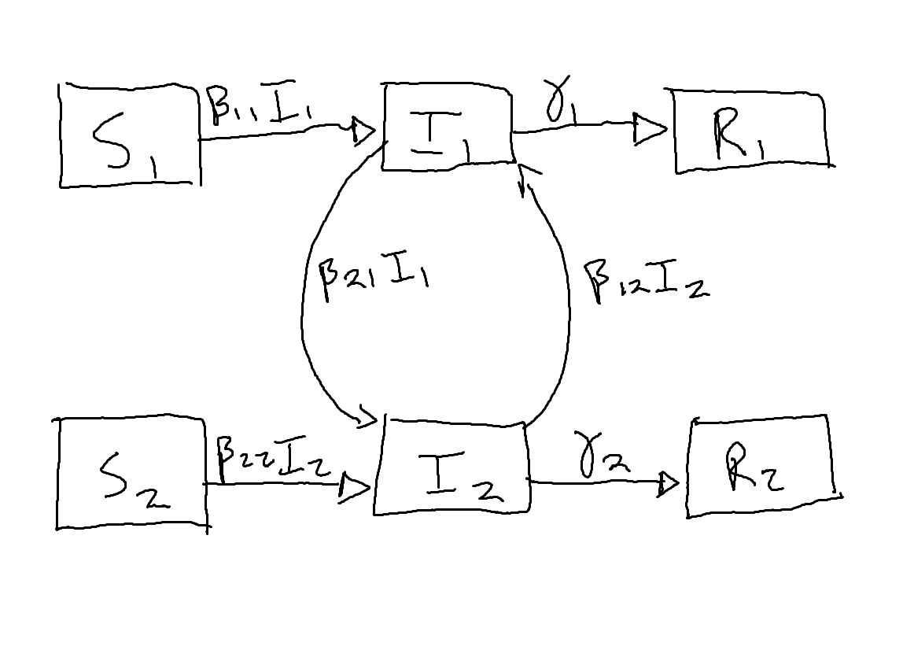

```{r setup, include=FALSE}
knitr::opts_chunk$set(echo = TRUE, fig.pos = 'h')
```

In lecture we learned about how heterogeneity is added to the SIS model to represent sexually-transmitted diseases in human populations. In these models, when we talk about heterogeneity, we mean that different groups (or "classes") of humans have different levels of risk, mediated through sexual activity. 
Heterogeneity, however, can mean many different things, leading to different "classes" of hosts that might need to be accounted for in our models. In this assignment, we will deal with a different type of heterogeneity - heterogeneity among wildlife host species.

Here we're going to talk about multi-host pathogens, which are pathogens that can infect more than one host species to some degree. 
For example, rabies virus can infect all mammals, West Nile virus can infect many bird species and humans to some degree, *Borrelia burgdorferi* is the bacterium that causes Lyme disease and can infect many mammals and some birds. 
Some multi-host pathogens are risks to wildlife conservation, because virulent pathogens can drive host populations - or entire species - to extinction.
For example, chytridiomycosis is a fungal disease of amphibians that has caused the extinction of many frog species across the world.
Multi-host pathogens are also important agents of human disease. 
Wildlife species can serve as reservoirs of disease that can spillover to human populations (e.g., mammals and rabies, birds and West Nile virus, mammals and Lyme disease, non-human primates and Zika virus, bats and coronaviruses, etc.). 
These are called "zoonotic" pathogens, ones that can infect non-human animals, as well as humans. 

For multi-host pathogens, some host species are more "competent" hosts than others. 
Competency is defined by how easily a host species can become infected and then spread the pathogen to susceptible hosts. 
High competency hosts are very good at becoming infected and spreading the pathogen.
Among host species, there is a high degree of variability in host competency. 
For instance, some bird species can produce a lot of West Nile virus to infect mosquitoes and other birds, while other bird species might become infected but quickly die before they can spread the virus, while other bird species cannot become infected at all.  

In general, it is now well-recognized that if we want to understand how multi-host pathogens affect wildlife management programs, or if we want to understand the risk of zoonotic pathogens to humans, we must consider the variability in epidemiological traits (i.e., model parameters) between host species. 
Moreover, as you will see in many of the supplemental readings for this week, it is becoming clear that the level of biodiversity (i.e., how many species are present in an area) can have profound effects on how much disease we expect to see in an area. 

We will explore a model that attempts to account for variability in epidemiological traits (i.e., model parameters) amongst more than one host species:
$$\begin{aligned}
\frac{dS_{i}}{dt} &= - S_i \sum_{j=1}^{N} \beta_{i,j} I_j \\
\frac{dI_{i}}{dt} &= S_i \sum_{j=1}^{N} \beta_{i,j} I_j - \gamma_{i} I_{i} \\
\frac{dR_{i}}{dt} &= \gamma_{i} I_{i}
\end{aligned}$$

In this multi-species SIR model, we have $N$ species, and each species is identified by the index, $i$. The susceptible individuals of each species can become infected by infectious individuals of their own species at the rate $\beta_{i,i}$, or they can become infected by infectious individuals of other species at the rates $\beta_{i,j}$, such that, for example, $\beta_{1,2}$ would be the rate of transmission from species 2 to species 1. Thus the total rate of transmission to species $i$ is the sum of forces of infection from all other species. The model assumes that each species has its own rate of recovery, and that these individuals are becoming immune for life. 

This model allows for three primary mechanisms of heterogeneity. First, species vary in the rates that they cause new infections ($\beta$). Second, species vary in how long they are infectious, mediated by the recovery rate, $\gamma$. Third, as we will discuss below, species vary in relative abundance in the host community, meaning that some species are more common than others, and this will affect contact rates between species. 
We will now try to understand how these sources of variability influence epidemic dynamics.

# Task 1 (15 points)

1. Sketch a box and arrows diagram that represents this model in a system of two host species. Be clear about the parameters that lie along the lines/arrows (i.e., what are the flow rates?). Also be clear about who is getting infected from whom. You can attach this as a photo or add the image to your .RMD file (we've seen how to do this before).



2. Skim through one of these readings in the course content: Keesing *et al.* 2010 or Rohr *et al.* 2020. Briefly describe an example in which biodiversity has been found to affect the spread of a particular pathogen. (1 short paragraph maximum here)

\textbf{Keesing writes in his paper that a parasitic worm which can cause schistosomiasis is more likely to end up in unsuitable hosts in systems with high amounts of biodiversity. This indicates that in environments with higher amounts of biodiversity, the transmission rate of the schistosomiasis pathogen will be significantly lower than in environments with lower amounts of biodiversity.}

\newpage

### Calculating $R_{0}$ from this model

As we discussed in class, the $R_{0}$ for the SIS model with multiple risk classes can be determined by inspecting the next-generation matrix, $G$. Specifically $R_{0}$ is equal to the *dominant eigenvalue* of this matrix. Calculating $R_{0}$ for the multi-host SIR model is the same. In this case, however, we have transmission that occurs between host species, rather than transmission between risk classes of the same host species. 
In the $G$ matrix, we multiply by the proportional abundance of each species in the area (i.e., the fraction of the whole host community that is comprised of each species). 
We denote this proportion for each species as $p_i$, which is analogous to $n_H$ and $n_L$ that we discussed in lecture. 
Remember, $n_H + n_L = 1$, and similarly $\sum_{i=1}^{N} p_i = 1$.
This is important, because $p_i$ tells us how frequently any two species might contact one another. 
For instance, say Species 1  makes up a large proportion of the whole host community (e.g., $p_1 = 0.8$), then the other species will frequently contact Species 1. 
Species 1 will therefore have a larger relative impact on the overall transmission dynamics.

As an example, the $G$ matrix of the multi-species SIR model for 3 species of hosts, looks like:
$$G = 
\begin{bmatrix}
\frac{\beta_{1,1} p_1}{\gamma_{1}} & \frac{\beta_{1,2} p_1}{\gamma_{2}} & \frac{\beta_{1,3} p_1}{\gamma_{3}} \\
\frac{\beta_{2,1} p_2}{\gamma_{1}} & \frac{\beta_{2,2} p_2}{\gamma_{2}} & \frac{\beta_{2,3} p_2}{\gamma_{3}} \\
\frac{\beta_{3,1} p_3}{\gamma_{1}} & \frac{\beta_{3,2} p_3}{\gamma_{2}} & \frac{\beta_{3,3} p_3}{\gamma_{3}} \\
\end{bmatrix}$$

In this matrix, each column represents how a species infects other species, and the diagonal represents how a species infects individuals of its own species. Now, $R_{0}$ for the multi-host system is estimated by the dominant eigenvalue of the $G$ matrix. We call this the "Community $R_{0}$". 
The Community $R_{0}$ represents the average number of new hosts (of any species) that will be infected by the addition of a single infectious host (of any species, on average) to a fully susceptible community made up of all of the species. 

### How does species richness (i.e., the number of species in a community) affect epidemic dynamics? 

It is now our goal to understand how adding species to the system (i.e., increasing biodiversity and, therefore, increasing host heterogeneity) affects epidemics. 
This will require a number of steps, and I will walk you through them. 
We need to devise a computational strategy for assigning the transmission and recovery rates and the proportional abundance of any arbitrary number of species.
Then we will use these rates and proportions to construct the $G$ matrix. 
To do this, we will build some functions. 

First, we will calculate the transmission rates $\beta_{i,i}$ and $\beta_{i,j}$. To make things work out in the end mathematically, we need to make an assumption. We will assume that between-species transmission is less than within-species transmission. In other words, individuals of species 1 are more likely to transmit the pathogen to other individuals of species 1 compared to individuals of species 2. This could be the case, for example, if species encounter their own kind more frequently than they encounter other species, which turns out to be a reasonable assumption. We also assume symmetrical transmission, such that the rate of transmission from species 2 to 1 is the same as the rate from species 1 to 2. 
Remember this is a very similar assumption we spoke about in lecture with regard to high- and low-risk sexual groups in the SIS model.
Therefore we define:
$$
\beta_{i,j} = c \left( \frac{\beta_{i,i} + \beta_{j,j}}{2} \right)
$$
Here, $c$ is a constant of proportionality, and we will assume $c=0.1$, which means that $\beta_{i,j}$ will always be substantially less than the average of a pair of species' within-species transmission rates $\beta_{i,i}$ and $\beta_{j,j}$.

\newpage 

### Build the $\beta$ matrix

For a two-species system, remember that the $\beta$ matrix looks like this:
$$\bf{B} = \begin{pmatrix}
\beta_{i,i} & \beta_{i,j} \\
\beta_{j,i} & \beta_{j,j}
\end{pmatrix}$$
Let's create a function to assign values of transmission for any arbitrary number of species. This will therefore depend on the number of host species we care about, and and the value of $c$, which modulates the strength of between-species transmission:

```{r beta_matrix_func}
# Assign the number of species in the host community:
N = 3     
# Assign the value of $c$, mediating the strength of between-specific transmission:
c_val = 0.1  

beta_matrix_func = function(N, c_val){
  
  # Make an N x N matrix to store the beta values:
  beta_matrix = matrix(0, ncol = N, nrow = N)

  # The diagonal of the matrix represents within-specific transmission (\beta_{i,i})
  # The runif() function randomly draws from a uniform distribution of real numbers
  # between the min and max values (read it like "random-uniform" = runif() )
  diag(beta_matrix) = runif(N, min = 0, max = 10)
  
  # Now we will assign the values of between-specific transmission (e.g., $\beta_{i,j}$)
  # We use a nested for-loop to traverse the matrix:
  for(i in 1:N){
    for(j in 1:N){
      
      # We only want to assign the off-diagonals:
      if(i != j){
        beta_matrix[i, j] = c_val * ( (beta_matrix[i, i] + beta_matrix[j, j]) / 2 )
      }
      
    }
  } 

  return(beta_matrix)
  
} # end the function

# Now test the function
beta_matrix_func(N, c_val)

```

\newpage

# Task 2 (10 points)

Now, we need to assign values for recovery rates for each species, $\gamma_{i}$. We also need to assign the proportional abundances of each species, ($p_i$). 

1. Use the code below. Create a function to assemble the $G$ matrix for any given number of species.

```{r recovery-rates}

# Store the beta matrix as an object for later:
beta_ij = beta_matrix_func(N, c_val)

# Draw values of recovery rate
# We want the average infectious period to range from 2 days to 10 days:
gamma_i = runif(n = N, min = 1/10, max = 1/2)

# Draw arbitrary values of the abundance of each species. 
abund_i = runif(n = N, min = 1, max = 1000)
# Convert these to proportional abundance
# Ensure they sum to one, by dividing by the total abundance
p_i = abund_i / sum(abund_i) 

########################
# YOUR TASK ############
########################
# Finish this function to assemble the $G$ matrix for any given number of species.

G_matrix_func = function(N, beta_ij, gamma_i, p_i){
  
  # Create a blank matrix:
  G_matrix = matrix(0, nrow = N, ncol = N) 
  
  ########################
  # How do we fill the matrix? 
  ########################
  
  for (i in 1:N)
  {
    for (j in 1:N)
    {
      G_matrix[i, j] = (beta_ij[i,j] * p_i[i]) / gamma_i[j]
    }
  }
  
  return(G_matrix)
}

completed_matrix = G_matrix_func(N, beta_ij, gamma_i, p_i)
```

2. Calculate the dominant eigenvalue of the $G$ matrix for one hypothetical case. The dominant eigenvalue is just the first eigenvalue that is produced by the eigen() function. This represent the Community $R_{0}$ of the multi-host pathogen.
```{r}
g_eigen_vals = eigen(completed_matrix)

print(g_eigen_vals$values[1])
```


\newpage
# Task 3 (20 points)

1. We want to demonstrate how the average Community $R_{0}$ of a given pathogen might change as the number of host species in a community changes. 
Use the code hints below, and fill in the blank figure with data points to show this relationship. 
You will need to calculate values of Community $R_{0}$ for 1500 unique (i.e., randomly generated) multi-host communities.
Each randomly generated community will have a unique number of species, and each species will have unique traits (i.e., transmission, recovery, proportional abundance).
Each community will therefore have a unique $G$ matrix and associated Community $R_{0}$.
Vary species richness (i.e., the number of host species) randomly between 2 and 30 species. 


```{r final-figure}
# This creates a vector of size 1500, by sampling integers with replacement.
N_vector = sample(c(2:30), size = 1500, replace = TRUE) 

# Set up a plot:
# You may need to adjust your y-axis limits
plot(NA,NA,
     xlim = c(2, 30),
     ylim = c(0, 50),
     xlab = "Host Species Richness (number of host species)",
     ylab = expression("Community"~R[0]))

# Use a for-loop and your functions to calculate Community $R_0$
# for 1500 unique (randomly generated) host communities

for (i in 1:1500)
{
  # Get vector value for number of species in community
  num_species = N_vector[i]
  
  # Generate random vector values for abundance, transmission, recovery
  gamma_i = runif(n = num_species, min = 1/10, max = 1/2)
  abund_i = runif(n = num_species, min = 1, max = 1000)
  p_i = abund_i / sum(abund_i)
  
  # Generate Beta value matrix
  community_b_matrix = beta_matrix_func(num_species, c_val)
  
  # Generate G matrix
  community_g_matrix = 
    G_matrix_func(num_species, community_b_matrix, gamma_i, p_i)
  
  # Calculate G matrix eigen values
  community_eigen_vals = eigen(community_g_matrix)
  
  # Find community R-naught value from eigen values
  r_naught_val = community_eigen_vals$values[1]
  
  # Plot number of species against community R-naught value
  points(num_species, r_naught_val)
}

# Show the Community $R_0$ as points on the graph.
# points()
```


2. You may have to run your code a few times, but you should start to see a repeatable, average relationship between $R_{0}$ and the species richness of the host community. Comment on this relationship. How does this relate to the readings you skimmed (either Keesing *et al.* 2010 or Rohr *et al.* 2020)?

\textbf{Keesing writes in his 2010 paper that a higher diversity of host species significantly increases the chance that a pathogen will end up in an unsuitable host. This leads to the instance where the majority of hosts in a diverse system are unsuitable for a given pathogen. Hence, a very diverse system will have a lower rate of transmission.}

\textbf{The graph above seems to be in line with what Keesing wrote. It is clear from looking at the graph that in communities with high host richness, the $R_0$ value is significantly lower than in communities with lower host richness. This would indicate that more diverse communities hold a higher number of species that are unsuitable for a given pathogen to infect. Hence, the higher species diversity lowers the overall transmission of the pathogen throughout the community.}

